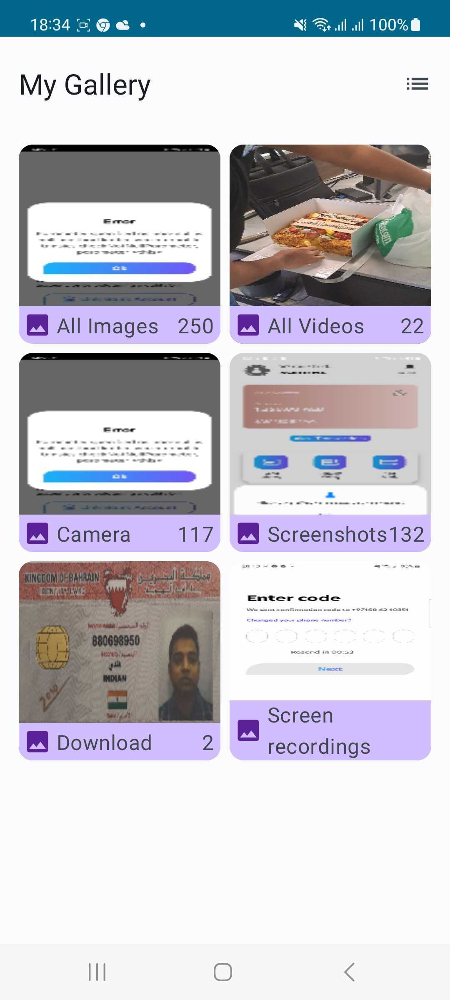
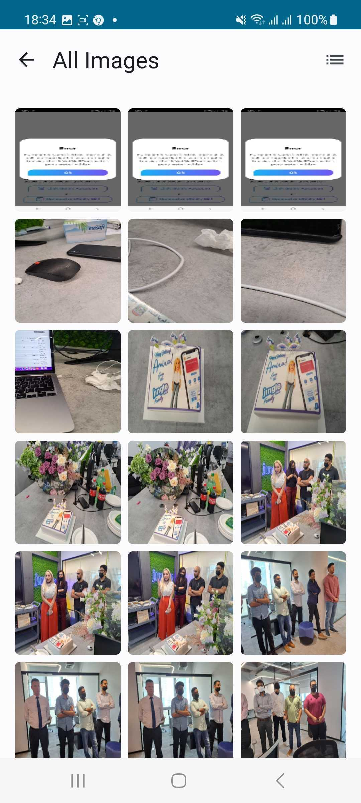

# Gallery App

This application shows a List/Grid of Albums. Each item is showing the name and count of Album.
when click on Album, App navigates to the new screen, where it displays the media under the Album.

Album name "All Images" contains all images from device
Album name "All video" contains all videos from device.
Camera folder contains the images taken from device camera.

* Main screen of the application

* Detail screen of the application

### Using Technologies ###

* Kotlin
* MVI
* SOLID Principles
* Android Clean Architecture
* Multi/Feature Modular Approach
* Dagger Hilt for Dpendendency Injection
* Kotlin coroutines
* Kotlin Flows
* Jetpack Compose
* Jetpack Navigation component for compose
* Glide
* Gson

## Project contains three basic layers of Clean Architecture ##

* Presentation Layer (Features contain Ui and View Models)
* Domain Layer (Use cases , business logic )
* Data Layer (Repositories , data source)

